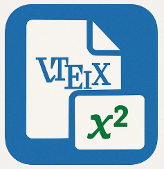

# TexMex



---


---

TexMex is a Visual Studio Code extension that provides live LaTeX preview functionality, similar to Overleaf, but integrated directly into your editor. It allows you to write, compile, and preview LaTeX documents in real-time.

## Features

- **Live Preview**: See your LaTeX document rendered in real-time as you type
- **PDF Download**: Save your compiled documents as PDF files
- **Automatic Updates**: Preview updates automatically when you save or edit
- **Error Handling**: Clear error messages when compilation fails
- **Customizable**: Configure compiler path and update delay

## Requirements

- Visual Studio Code version 1.85.0 or higher
- A LaTeX distribution installed locally (e.g., TeX Live, MiKTeX)
- Node.js and npm (for development)

## Installation

1. Open VS Code
2. Press `Ctrl+Shift+X` (Windows/Linux) or `Cmd+Shift+X` (macOS)
3. Search for "TexMex"
4. Click Install

## Usage

### Opening the Preview

1. Open a `.tex` file
2. Press `Ctrl+Shift+P` (Windows/Linux) or `Cmd+Shift+P` (macOS)
3. Type "TexMex: Open Live Preview" and press Enter
4. The preview will open in a side panel

### Downloading PDF

1. With the preview open, click the "Download PDF" button in the top-right corner
2. Choose where to save the PDF file
3. The PDF will be saved to your chosen location

### Configuration

You can customize TexMex through VS Code settings:

```json
{
    "texmex.latexPath": "pdflatex",  // Path to your LaTeX compiler
    "texmex.updateDelay": 1000       // Delay before preview updates (in milliseconds)
}
```

## Development

### Building from Source

1. Clone the repository:
   ```bash
   git clone https://github.com/RahulChalla/texmex.git
   cd texmex
   ```

2. Install dependencies:
   ```bash
   npm install
   ```

3. Compile the extension:
   ```bash
   npm run compile
   ```

4. Package the extension:
   ```bash
   npx @vscode/vsce package
   ```

### Available Scripts

- `npm run compile`: Compile the TypeScript code
- `npm run watch`: Watch for changes and recompile
- `npm run lint`: Run ESLint
- `npm run test`: Run tests
- `npm run clean`: Clean build artifacts

## Contributing

Contributions are welcome! Please feel free to submit a Pull Request.

1. Fork the repository
2. Create your feature branch (`git checkout -b feature/amazing-feature`)
3. Commit your changes (`git commit -m 'Add some amazing feature'`)
4. Push to the branch (`git push origin feature/amazing-feature`)
5. Open a Pull Request

## License

This project is licensed under the MIT License - see the [LICENSE](LICENSE) file for details.

## Support

- Report bugs on [GitHub Issues](https://github.com/RahulChalla/texmex/issues)
- Request features on [GitHub Issues](https://github.com/RahulChalla/texmex/issues)
- Star the repository if you find it useful!

**Marketplace:** [https://marketplace.visualstudio.com/items?itemName=RahulChalla.texmex](https://marketplace.visualstudio.com/items?itemName=RahulChalla.texmex)  
**Extension Management Hub:** [https://marketplace.visualstudio.com/manage/publishers/RahulChalla/extensions/texmex/hub](https://marketplace.visualstudio.com/manage/publishers/RahulChalla/extensions/texmex/hub)

---

## System Requirements

- Visual Studio Code version 1.85.0 or higher
- A LaTeX distribution installed locally (e.g., TeX Live, MiKTeX)
- Node.js and npm for extension development or local builds

---

## Usage

1. Open a `.tex` file in the editor.
2. Open the Command Palette (`Ctrl+Shift+P` or `Cmd+Shift+P`).
3. Run the command **TexMex: Open Live Preview**. This will open a side panel with a rendered PDF view of your document.
4. As you edit and save the `.tex` file, the preview will update automatically.
5. To manually compile and save the PDF to your working directory, run **TexMex: Save as PDF** from the Command Palette.

---

## Configuration Options

TexMex can be customized through the VS Code settings (`.vscode/settings.json` or global settings):

```json
"texmex.latexPath": "pdflatex",
"texmex.updateDelay": 1000
