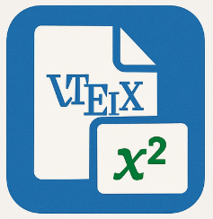

# 👋 Welcome to TexMex!

Thank you for installing **TexMex** — your LaTeX live preview and PDF export extension for Visual Studio Code.

## 🚀 What Can You Do?
- **Live Preview:** Instantly see your LaTeX document as you type
- **Download PDF:** Click the download button in the preview to save your work
- **Automatic Updates:** Preview refreshes on save or edit
- **Customizable:** Change compiler path and update delay in settings

## 🛠️ Get Started
1. Open a `.tex` file
2. Press `Ctrl+Shift+P` (or `Cmd+Shift+P` on Mac)
3. Run `TexMex: Open Live Preview`
4. Start editing and see your changes live!

## 📚 Resources
- [Documentation & Usage](https://github.com/RahulChalla/texmex#readme)
- [Report Issues](https://github.com/RahulChalla/texmex/issues)
- [Marketplace Page](https://marketplace.visualstudio.com/items?itemName=RahulChalla.texmex)

## 🙏 Thank You
If you enjoy TexMex, please consider leaving a review or starring the [GitHub repo](https://github.com/RahulChalla/texmex)!

Happy TeXing! 🎉 