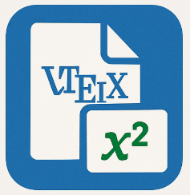

# Welcome to TexMex

Thank you for installing **TexMex** — your LaTeX live preview and PDF export extension for Visual Studio Code.

**No LaTeX installation needed.** TexMex bundles its own LaTeX engine (Tectonic) and downloads it automatically the first time you compile.

## What Can You Do?
- **Live Preview:** Instantly see your LaTeX document as you type
- **Download PDF:** Click the download button in the preview to save your work
- **Automatic Updates:** Preview refreshes on save or edit
- **Customizable:** Adjust update delay, peer settings, or opt into your own LaTeX install in settings

## Get Started
1. Open a `.tex` file
2. Press `Ctrl+Shift+P` (or `Cmd+Shift+P` on Mac)
3. Run `TexMex: Open Live Preview`
4. The first run downloads the LaTeX engine (~10-22MB, one-time) — after that, just start editing and see your changes live!

## Resources
- [Documentation & Usage](https://github.com/rahul-challa/TexMex#readme)
- [Report Issues](https://github.com/rahul-challa/TexMex/issues)
- [Marketplace Page](https://marketplace.visualstudio.com/items?itemName=RahulChalla.texmex)

## Thank You
If you enjoy TexMex, please consider leaving a review or starring the [GitHub repo](https://github.com/rahul-challa/TexMex).
